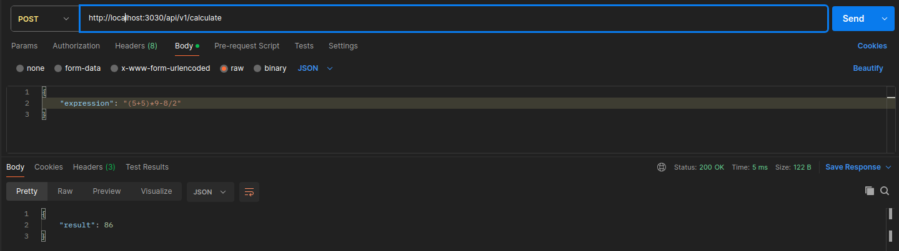

# Веб-сервис подсчета арифметических выражений
## Описание проекта
Проект содержит веб-сервис, с помощью которого пользователь отправляет арифметическое выражение на эндпоинт в формате JSON и получает в ответ результат его вычисления или сообщение об ошибке.
Арифметическое выражение может содержать цифры, знаки сложения, знаки вычитания, знаки умножения и знаки деления. Для установки приоритета выполнения части выражения используются "круглые" скобки.

Необходимо выполнить заупск веб-сервера с сервисом проекта и отправить POST-запрос на указанный URL. Например, при запуске на локальном сервере на порту 3030, url эндпоинта будет выглядеть: 
    
    http://localhost:3030/api/v1/calculate

## Структура проекта
Проект состоит из файлов и папок: 

    - cmd/main - основной файл проекта
    - cmd/main_test - тесты 
    - service/service - сервис расчета выражений
    - README.MD - описание проекта

## Сценарии использования

http://localhost:3030/api/v1/calculate

У сервиса один endpoint с url-ом .../api/v1/calculate. Пользователь отправляет на этот url POST-запрос с телом:

    {
        "expression": "выражение, которое ввёл пользователь"
    }

Для того, чтобы отправить запрос можно использовать Postman или curl. Пример вызова API с помощью утилиты curl:

    curl --location 'localhost:3030/api/v1/calculate' \
    --header 'Content-Type: application/json' \
    --data '{
      "expression": "2+2*2"
    }'
   
Пример вызова из Postman

## Варианты ответов сервиса
В ответ пользователь получает HTTP-ответ с телом:

{
    "result": "результат выражения"
}

и кодом 200, если выражение вычислено успешно, либо HTTP-ответ с телом:

{
    "error": "Expression is not valid"
}

и кодом 422, если входные данные не соответствуют требованиям приложения — например, кроме цифр и разрешённых операций пользователь ввёл символ английского алфавита.

Ещё один вариант HTTP-ответа:

{
    "error": "Internal server error"
}

и код 500 в случае какой-либо иной ошибки («Что-то пошло не так»).

## Запуск проекта

Для запуска сервера нужно перейти в рабочую директорию проекта и выполнить запуск основного файла проекта:

    go run ./cmd/main.go
    
   

## Запуск тестов
Для запуска тестов необходимо перейти в папку cmd и выполнить запуск тестов:

    cd cmd/
    go test -v -timeout 30s

